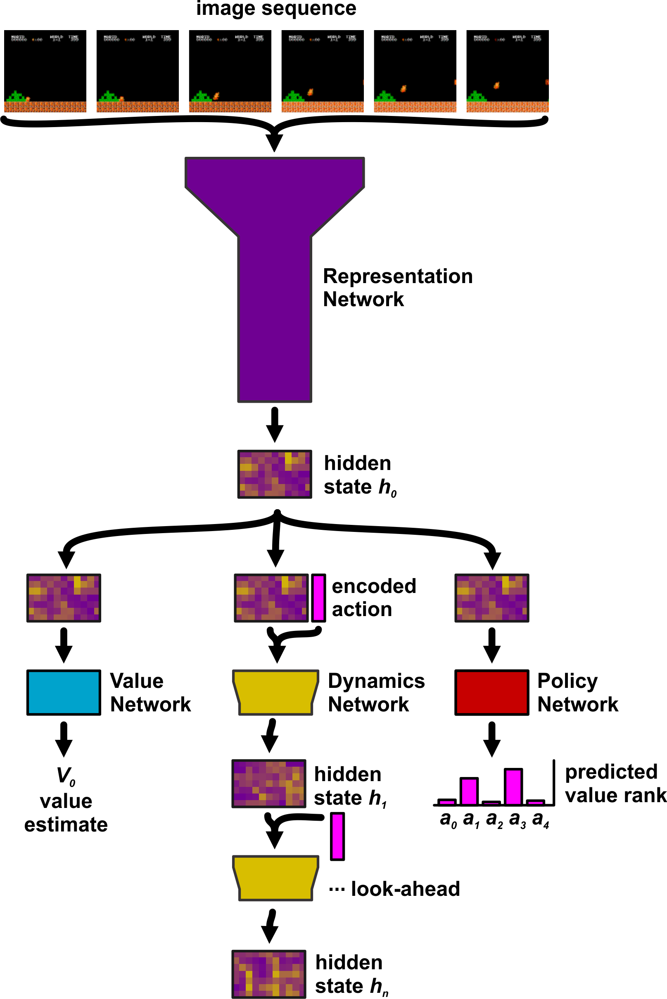

MuZero - Lite
======

This repository is a Python implementation of a heavily modified MuZero algorithm. 

Examples
======

Below are examples of gameplay after 6 days of training on a gaming PC.

         

Neural Networks
======
 - Representation network: observation --> hidden state
 - Policy network: hidden state --> relative predicted value of each move
 - Value network: hidden state --> predicted value
 - Reward network: hidden state --> predicted reward
 - Dynamics network: hidden state + action --> hidden state (future)
 - Exploration network: hidden state --> predicted policy

Self Play
======
- Instead of performing a Monte-Carlo tree search, actions are selected through a truncated search which ranks the output of the Policy network and evaluates the highest-ranking moves.
- Games are saved to file instead of loaded directed into the replay_buffer
- Gifs of each game are saved during training because they are fun to watch

Training
======
- Games are loaded from file to fill the replay_buffer
- Experiences are sampled using Prioritized Experience Replay
- Policy network is trained to the normalized value of each move from the self play truncated search
- Value network is trained to the time-discounted future value + discounted accumulated future reward
- Reward network is trained to the reward values
- Exploration network is trained to the predicted policy from the Policy network. The loss value for the policy network is reduced by a fraction of the exploration network's loss.

**DISCLAIMER**: this code is early research code. What this means is:

- Silent bugs may exist.
- It may not work reliably on other environments or with other hyper-parameters.
- The code quality and documentation are quite lacking, and much of the code might still feel "in-progress".
- The training and testing pipeline is not very advanced.
